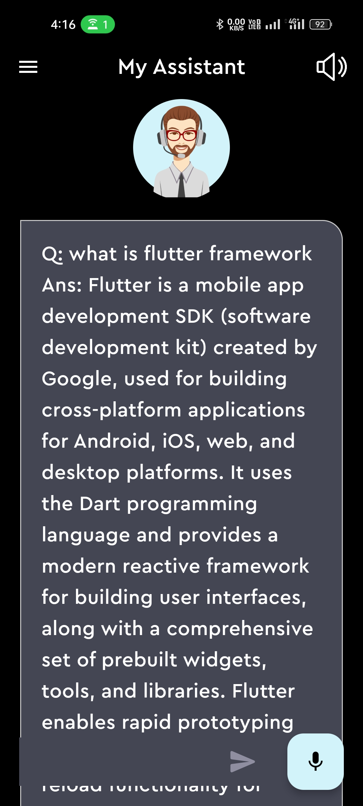
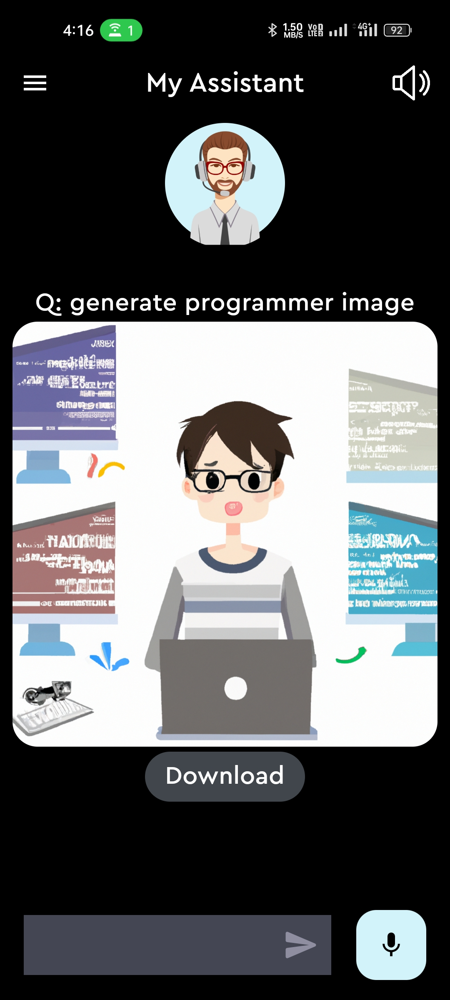

<!-- <h1 align="center">
     
    Travel App in Flutter
</h1> -->
## Travel App in Flutter

<!-- <h4 align="start">
 This is a basic mobile application that uses the flutter framework to create a Travel App.
</h4> -->

### Some Screenshots

    

    

  

